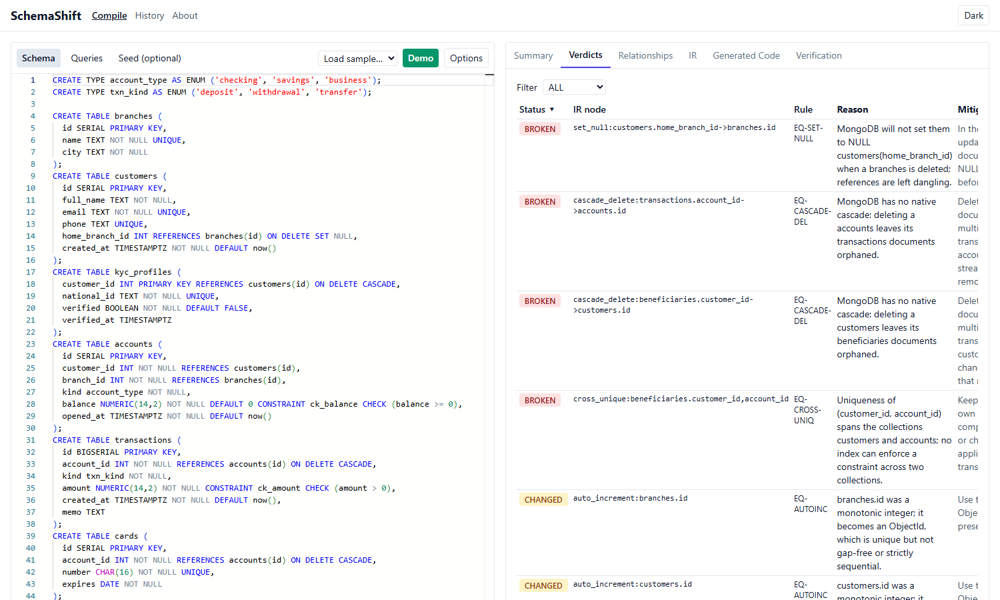
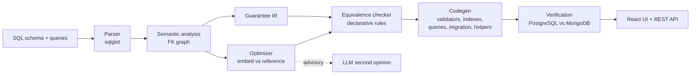

# SchemaShift

SchemaShift is a compiler that migrates a PostgreSQL schema and its queries to MongoDB. It does not
just move data: it works out which **guarantees** the SQL schema gave you (foreign keys, cascades,
uniqueness, NULL and ordering semantics, atomic multi-table writes) and reports, per guarantee,
whether MongoDB keeps it (**SAFE**), changes it (**CHANGED**) or loses it (**BROKEN**). It then picks
embed vs reference for every relationship, generates the MongoDB code, and proves the result by
running the SQL on PostgreSQL and the translated queries on MongoDB against the same data.



The **Demo** button loads the banking sample, compiles it and starts a verified run.

## Architecture



Compiler stages are pure functions over frozen pydantic models. Only `verification/`, `ai/` and
`api/` perform I/O. User SQL is parsed, never executed as text. See `docs/ARCHITECTURE.md`.

## Quickstart (Windows / PowerShell)

```powershell
copy .env.example .env
docker compose up --build
# API docs:  http://localhost:8000/api/docs
# Web app:   http://localhost:5173   (pick "banking" under Load sample, then Compile)
```

Without Docker (compile only, no verification):

```powershell
./scripts/dev.ps1 setup
cd backend; .venv\Scripts\python -m uvicorn schemashift.api.main:app --reload
cd frontend; npm run dev
```

Dev tasks (`./scripts/dev.ps1 <target>` or `just <target>`): `setup`, `dev`, `test`,
`test-integration`, `lint`, `typecheck`, `build`, `migrate`, `evaluate`.

Command line:

```powershell
cd backend
.venv\Scripts\python -m schemashift.cli compile ..\samples\ecommerce\schema.sql --queries ..\samples\ecommerce\queries.sql
.venv\Scripts\python -m schemashift.cli evaluate --write-docs
```

## What you get

| Result tab | Content |
|---|---|
| Summary | Overall verdict, SAFE/CHANGED/BROKEN counts, diagnostics |
| Verdicts | Per-guarantee status, reason, mitigation, "Why?" condition trace, source highlighting |
| Relationships | Graph of tables and FKs, EMBED/REFERENCE decision, score factors, AI opinion, override |
| IR | The printed intermediate representation |
| Generated Code | Validators, indexes, translated queries, migration script, enforcement helpers (mongosh + PyMongo) |
| Verification | Per-query MATCH/MISMATCH with diff and hypothesis, plus probes that demonstrate each BROKEN/CHANGED verdict |

## Quality

Measured by `schemashift evaluate` (details and limits in `docs/METRICS.md`):

| Metric | Value |
|---|---|
| Detection rate (corpus, 32 schemas, 883 labeled nodes) | 100% |
| False positive rate | 0% |
| Result-set correctness (21 sample queries, real PostgreSQL vs MongoDB) | 100% |
| AI agreement | not measured without an API key |

The corpus labels were written by the same author as the rules, so the first three numbers show
internal consistency with the documented semantics, not independent validation.

## Documentation

`SPEC.md` (requirements), `docs/ARCHITECTURE.md`, `docs/IR.md`, `docs/RULES.md` (generated),
`docs/OPTIMIZER.md`, `docs/CODEGEN.md`, `docs/VERIFICATION.md`, `docs/AI.md`,
`docs/SUPPORTED_SQL.md`, `docs/METRICS.md`, `docs/DEPLOYMENT.md`, `docs/DECISIONS.md`.

## Deployment

Vercel (frontend), Render or Railway (backend Docker image), Neon (PostgreSQL), MongoDB Atlas.
Step-by-step instructions, every environment variable and the security checklist are in
`docs/DEPLOYMENT.md`.

## Tests

```powershell
./scripts/dev.ps1 test               # unit tests (backend + frontend)
./scripts/dev.ps1 test-integration   # needs docker-compose.test.yml services
cd frontend; npx playwright test     # E2E (needs the API and dev server running)
```
